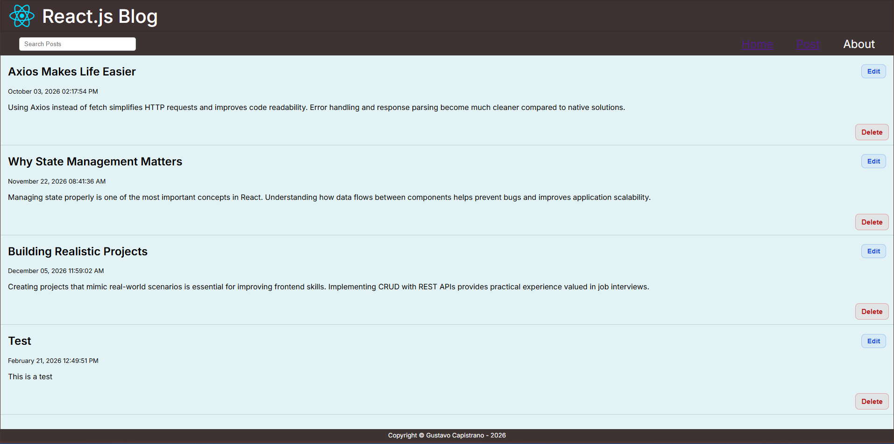
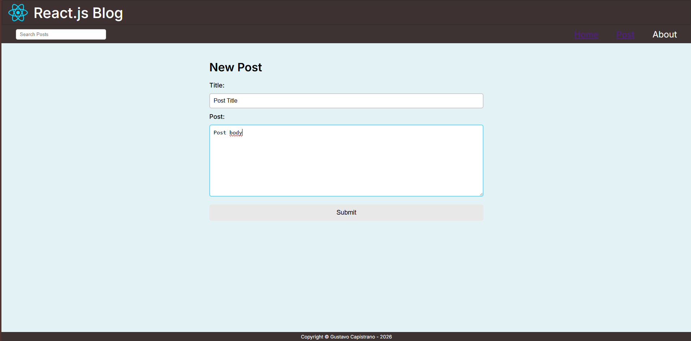

# React Blog

React Blog is a blog application built with React.  
Users can create, read, update, and delete posts in real time using a hosted API.

## Preview



## Features
- List all posts
- Search specific post
- Create new posts
- Update existing posts
- Delete posts
- Real-time interface updates
- Responsive layout

## Technologies
- React
- JavaScript
- Vite
- CSS
- Axios 

## Live Demo
https://react-blog-dun-nine.vercel.app/

## How to run locally
```bash
git clone https://github.com/GustavoCapis/react-blog.git
cd react-blog
npm install
npm run dev
```
The app will connect directly to the hosted API, so no backend setup is required.
